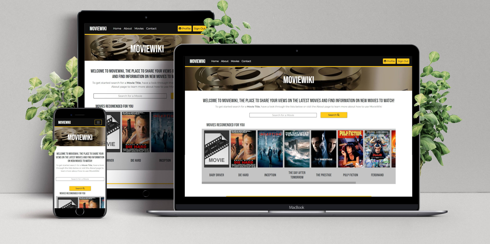
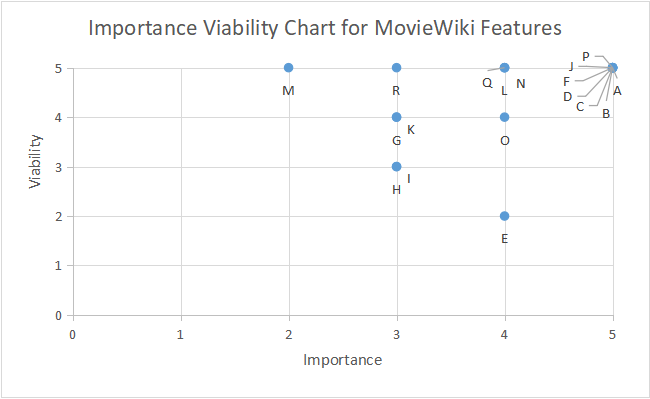
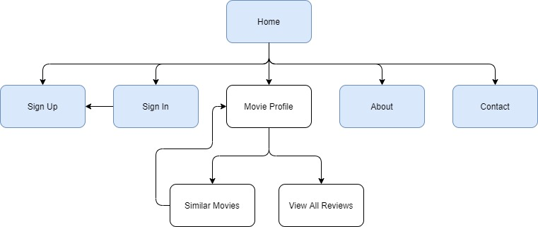
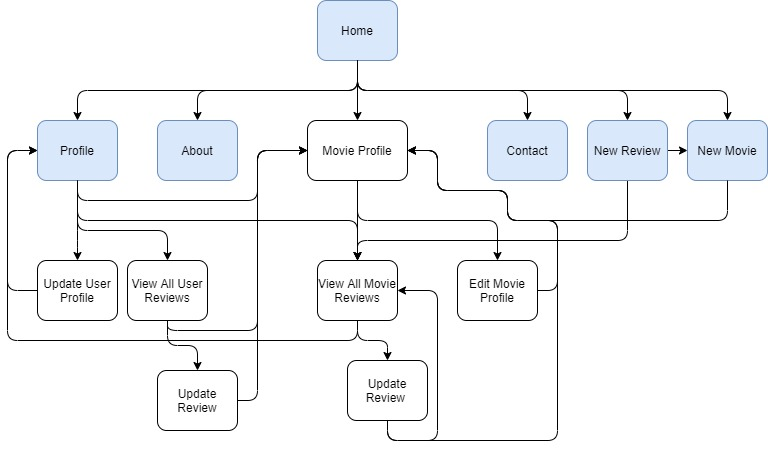
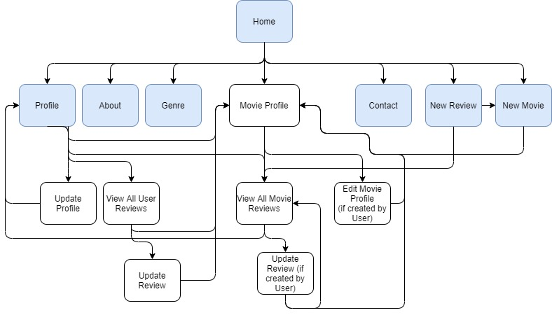
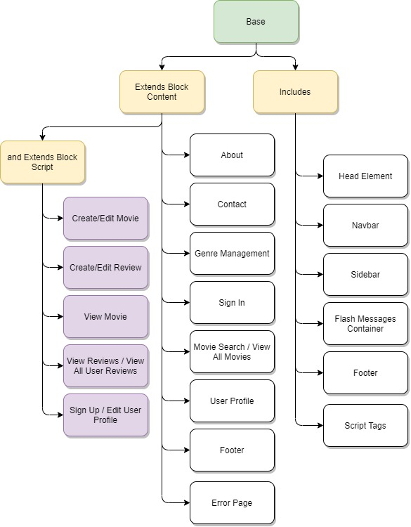
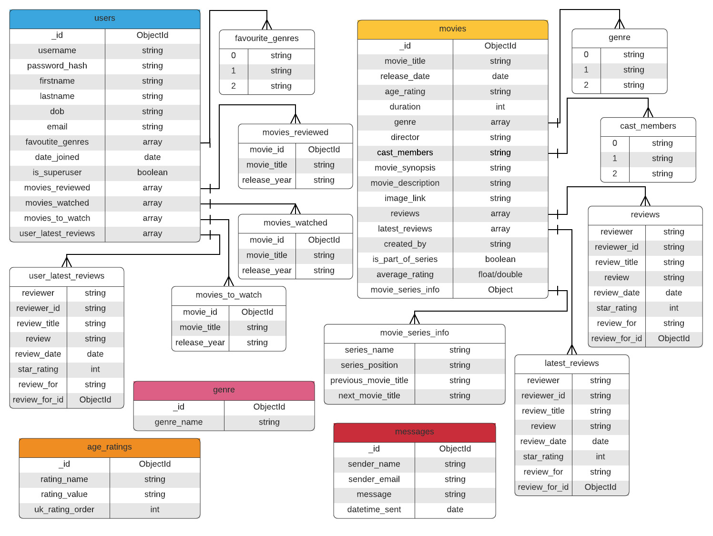
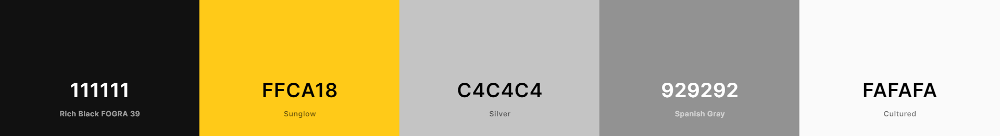

# MovieWiki
This project is designed to be a space where users can share their honest reviews and opinions on movies.

[Link to Live Project](https://moviewiki-project.herokuapp.com/)

This is the third of four Milestone Projects that make up the Full Stack Web Development Program at The Code Institute. The main requirements of this project are to *"build a full-stack site that allows your users to manage a common dataset about a particular domain"* using: **HTML**, **CSS**, **Javascript**, **Python+Flask** and **MongoDB**

I chose to build this project as I have a great love for movies and have spent a large amount of time watching them. 

I have seen so many movies that I forget what I have seen and when I come to pick a movie to watch I can never find anything new that I know I am going to like. This is where the idea for MovieWiki came from!

---

# UI & UX Development Planes

# Strategy

### Project Goals
- Develop a space where users can easily find information on movies, share their opinions on various movies and find other users' reviews,
- Build a responsive app using the Mobile First design principle,
- Present any information in an aesthetically pleasing way,
- Handle any errors in such a way to help the user understand the issue and provide an easy form of contact if any error should persist,

### Business Goals
- Provide a service that Users could pay to use additional functionality in,
- Build a platform that can facilitate productive and relevant adverts or sponsored links to secondary sites (eg. Streaming services or Cinemas)

### User Demographic
- All ages and backgrounds for viewing Movie information
- Ages 8 and up for contributing
- Has an interest in movies
- Want to contribute and share their opinions
- More comfortable using mobile devices

## Value to the User
- Stores and displays information about Movies (including the next movie in the series etc)
- Provides a space to share opinions
- Helps the user keep track of movies they have watched and want to watch
- Suggests new movies that they might enjoy

### User Stories

**Casual/First Time User** - As a casual/first time user who has not created an account, I want to be able to:
- Find out more about MovieWiki and how to use it
- Search for specific movies or view all movies
- Find the highest rateed movies and the latest releases
- View information about those movies
- Quickly establish if I should watch a Movie or not
- View movie reviews including ratings
- Contact the admin team if I have any problems, see incorrect information or want to report anything
- Create an account if I want to do more

**Contributer** - As a contributer who has signed in, I want to be able to:
- Do everything a Causal User can
- Add, edit and delete my own movie reviews
- View my latest reviews and all my reviews on the site
- Create movie profiles that don't exist yet
- Edit and Delete movie profiles that I created
- Keep track of what movies I have watched, reviewed and the ones I want to watch
- Have new movies suggested to me based on my movie genre preferences, age, what I have watched and the movie's review scores
- Edit my account information
- Delete my account

**Admin** - As an administrator, I want to be able to:
- Have the ability to maintain the website and the content on it
- Edit and Delete any Movie Profile
- Delete any Review
- Add, Modify and Delete any Genre Catagory

# Scope
### Feature Ideas Table

After an initial planning session I drew up a list of potential features to build into this project. Below is my Importance Viability analysis of these features.

| ID      | Feature | Importance |	Viability |
| ----------- | ----------- | ----------- | ----------- |
| A | View, Create, Edit and Delete Movie Information | 5 | 5 |
| B | View, Create, Edit and Delete Movie Reviews | 5 | 5 |
| C | View, Create, Edit and Delete Movie Genre | 5 | 5 |
| D | Create, Edit and Delete Account and Log In/Out | 5 | 5 |
| E | Moderate Content being submitted by Users | 4 | 2 |
| F | Send Messages to Admin | 5 | 5 |
| G | Receive notifications about activity related to the User | 3 | 4 |
| H | Report/Suggest corrections/updates for Movie Profiles | 3 | 3 |
| I | Display Cinema times & location/Link to streaming services on Movie Profile | 3 | 3 |
| J | Search Movie Profiles using Name| 5 | 5 |
| K | Advanced Movie Search using multiple parameters| 3 | 4 |
| L | View User Profile | 4 | 5 |
| M | Search User Profiles | 2 | 5 |
| N | Display Suggested/Relevant Movies to User | 4 | 5 |
| O | Tailor Movie Recommendations based on the Movie age rating | 4 | 4 |
| P | User Input Validation | 5 | 5 |
| Q | Save Movies onto a personal watched/want to watch list | 4 | 5 |
| R | Links to Socials | 3 | 5 | 

Having performed this analysis, I decided to remove features M, K, G, H, I and E from this production release due to many factors including time limitations.
Feature R (Links to socials) has been left in due to its simplicity.
Some of these features will have restricted access which will be controlled by if they are signed in or using a superuser account. 

## Functionality Requirements
- Clean and themed presentation of information
- Easy navigation to the required information
- Quick loading of the website
- Quick response times from calls to MongoDB
- Contact the developer for feedback/bug reports

## Structure

### Topology Diagrams

The Blue elements in these diagrams signify pages that are accessable from Navbar at all times.

Buttons not referances will return to the same page or return the home page.
Edit Movie Profile and Update Review only avaliable if User created page or review.
Delete functions will return to:
- Delete Review returns Movie Profile Page
- Delete Movie Returns Home
- Delete User Profile Returns Home

Guest User

Contributer User

Admin User

Jinja Template Structure/Relationships

### Database Structure

This project uses MongoDB as its database provider. 

This diagram shows the structure and schema used in the database.
The coloured headers are the different collections and the embedded documents are shown connected to the collections.

All data is stored in formats that make manipulating the data in python functions easier for example the user bate of birth field is stored as a string rather than a date. Default values are set to empty, 0 or none depending on data type.

## Skeleton

To view the wireframes for this project [click here](readme_assets/wireframe_display.md)

During the development of this project, I altered some of the elements in these wireframes. These are the main changes that I made:

|Page/Section |Alteration |Reason |
|-----|-----|-----|
|Navbar |Removed the active page ring from the nav items |Changing that while the navbar is being rendered from the Jinja base template was impossible |
||Added a Movies (with dropdown for signed in users) |Easier access to view all movies, add movie and add review pages which made the site flow much better|
|Mulitple Pages |Removed Green Color Button and replaced it with Gold |A mentor suggestion to keep in with the colour scheme|
||Limited the delete review and profile buttons to the edit pages |Avoid accidental deletion|
|User Profile |Removed other reviews button from user's latest reviews|Not needed |
|Create Movie |Removed Watched Movie switch |Not Needed as the user can control this on the next page they are taken to after adding a movie|
|Movie Profile |Removed Trailer, Nearest Cinema and Streaming Services Accordion |Features were removed and added to Future Features due to time limitations|
|View All Reviews |Review cards shortened to half the screen width |Reduce space as there is not that much information in a review|
|Genre |Remove accordion sections for each genre |Accordion element overused in project. Decided clean and simple is better|

### Design Decisions

Bootstrap provides a clean user-friendly appearance to the website which is easy to customise for the situation using its extensive supporting documentation.

**Colour Scheme**

I designed the colour scheme for this website from the header image that is used at the top of every page.

The colour scheme is high contrast and easily viewable. This is the final colour scheme I used:

All navigational sections have a black (#111111) background with the contrasting yellow/gold (#FFCA18) nav links.
Mobile devices use a hamburger-menu-naigation button to access the side navbar. The sidenav is positioned on the right, to make it more accessible to mobile users using one hand.

[Sidenav Image](readme_assets/sidenav_image.png)

The forms and fields follow the same custom look consistently across the website. The base of the input is a solid black (#111111) line, which changes color if the input is not validated. The labels are grey (#929292)

**Typography**

To suit the Movie theme of the website, I chose to use [Bebas Neue](https://fonts.google.com/specimen/Bebas+Neue) for the headers, logo and some buttons.
For the rest of the text, I decided to use the neutral looking font of [Montserrat](https://fonts.google.com/specimen/Montserrat) to balance the character of the heading font.

**Imagery**

The header image was used to develop the colour scheme.
The movie placeholder image was chosen as it fits with the colour scheme and fonts used. 

# Features

This is a full breakdown of all the features & elements that have been implemented for the first production release of MovieWiki.

### Multi Page Elements

**User Feedback** - All User Feedback messages will come in the form of "Flash Messages" displayed at the top of the screen, just below the header image.

**Navbar**
- Logo - to establish identity and act as a home button on smaller devices
- Home button - link to homepage
- About button - link to about page containing information, instructions and FAQs to inform users on what they can do on MovieWiki
- Movies dropdown menu which will contain links to:
    - "New Review" button - link to create review page (Only visible when logged in)
    - "New Movie" button - link to create movie page(Only visible when logged in)
    - View All Movies - link to view all movies page
    - This dropdown will be a single button for Movies when the user is not signed in
- Contact button - link to contact page which will auto fill user information when logged in
- Genre button - link to genre management which will only be avaliable to superusers
- Sign In/Sign Up buttons - link to sign_in/sign_up pages (Only visable when not logged in)
- Profile button - link to user profile
- Log Out button - runs signout() function and returns to home page

At Mobile screen widths, the navbar link will be contained in a sidebar which can be toggled with a button on the navbar. The dropdown will be removed for the sidebar, and the options will be displayed in full.

**Footer**
- Logo - to establish identity and act as a home button
- Back to top button - for easier navigation of larger pages to links in the navbar
- Links to socials for promotion

### /home

- Movie displays - on load will show User appropriate or recommended movies based on their profile and the movie's average rating
- Movie Search Bar - Will search all Movie names and return the results in the space where the Movie Displays were

### /signup

- Form input section - Collects data from user with appropriate validation. Favourite Film Genre list generated from Genre collection in the database
- Create Account button - will "POST" the data to the database and return the user to their user profile page
- Cancel button - links to homepage

### /signin

- Form input section - Collects data from user with appropriate validation
- Sign In button - compares the submitted data with the stored data to confirm Users identity. If information is correct then User is returned to their user profile page with a welcome message

### /profile

- User information section - formats and presents information received from the database (e.g. name, email address, favourite movie genres etc)
- Update Profile button - link to /profile/edit to edit page content
- Movies Watched/Want to Watch/Reviewed Accordion Section - Accordion section that displays all user generated lists.
- Latest Reviews Section - Shows the last 3 reviews this user added. This section will not be visible if the user has no reviews.

### /profile/edit

- Form input section - Auto filled with all existing values for the user to edit with appropriate validation
- Update Account button - updates the account information
- Delete Account button - calls the delete_profile() function and returns user to the homepage with a deletion notification (only available to User who created the page)
- Cancel button - returns user to their user profile page

### /profile/reviews/view

- Display all reviews in separate cards with update and view movie buttons
- Update review button will take the user to edit review page and bind existing review to the form
- View Movie will take user to the Movie the review is for

### /movies & /search

- Movie Search Bar - Will search all Movie names and return the results in the space where the Movie Displays were
- Shows all movies/search results with movie image, title and year of release
- On hover the images expand but don't overflow the container
- On clicking the image, the user is taken to the movie profile page

### /movie/<movie_id>/view

- Create Review/Sign in (depending on if the user is signed in) link just below the header image will take the user to the signin page or the review page with the movie title selected already
- Movie information section - formats and presents information received from the database including movie image. Empty fields are not shown.
- Average Star Rating display with numerical value and gold/black stars to depict value under the movie image
- "I Have/Haven't Watched This" Button - Toggles the movie on the Users watch list and adds the glasses icon next to the Movie Title if Movie is on the list
- "I Want/Don't Want to Watch This" button - Toggles the movie on the Users want to watch list and adds the a clipboard icon next to the Movie Title if Movie is on the list
- "View All Reviews" button - links to view_all_movie_reviews.html to allow the user to view all the reviews of that specific Movie
- Edit Profile button - link to create_movie_profile.html in edit mode to edit page content (only available to Admin and the User who created the page)
- Movie Description Accordion Section - Accordion elements containing full movie description (only displayed if description is included)
- Latest Reviews Section - Shows basic information for the 3 latest reviews for this movie
- Similar Movies Section - Displays movies in the same genre as the current film, not watched by the user and ranked in order of average star ratings as long as they are age appropriate

### movie/add

- Form input section - Collects data from user. Genre list generated from Genre collection in the database. If any input is invalid, a message will appear under the input advising the user. All required fields are marked with an asterix (*).
- "Is this movie part of a series" & Write Review switch - These switches toggle the extra input sections, in and out of view, which requires additional information. The fields become required when in view. The Series inputs' visibility is conditional to which radio button is pressed. Each section contains a checkbox which needs to be checked to allow the user to submit the information.
- Create Movie Profile button - will "POST" the data to the database and return the user to the view_movie.html page they just created
- Cancel button - Cancel button will return User to home page

### movie/<movie_id>/edit

- Includes all the features on movie/add
- Inputs are autofilled if the value is on the database document
- Delete Profile button - calls the delete_profile() function, removing the movie document and all mentions of that specific movie from all user documnets and returns user to the homepage with a deletion notification.

### /movie/<movie_id>/reviews

- Review cards - contains all information in the review
- Update Review button - link to create_review.html in edit mode to edit review content (only avaliable to the User who created the review)
- Delete Review button - calls delete review function and returns user to the homepage with a deletion notification (only avaliable to Admin to remove the need for Admin to go to the update movie page)

### /review/add

- Form input section - Collects data from user. Movie title dropdown will be filled with options from the movies in the database. If input is invalid, an error message will display below the input. All inputs are required
- Star Selector allows the user to choose a star rating by clicking one of the five stars.
- Submit Review - will "POST" the data to the database and return the user to the view_movie.html page they just created a review for
- Cancel button - Cancel button will return User to home page 

### /movie/<movie_id>/review/edit

- Includes all the features on review/add
- Inputs are autofilled/selected if the value is on the database document
- Delete Review button - calls delete review function, which removes the review from the movie and returns user to the homepage with a deletion notification.

### /genre (admin only)

- Add New Genre input and button - Collects admin input and "POST"s it to the database
- Genre Display section - An section that will be generated from the Genre collection with an Update Genre section and Delete Genre button
- Update Genre input and button - Collects input and "POST"s it to the database
- Delete - calls the delete_genre() function and returns to genre.html

### /contact

- Form input section - Collects data from user. On invalid input, an error message will display under the input
- Form name and email address will be autofilled when the user is signed in
- Send Message Button - Passes message data onto API to send message. Returns user to contact page with the form as it was initially and a message sent notification.

### /about

- FAQ Accordion - Contains FAQ information to help the user use MovieWiki

### /error

- Error message to help the user understand what went wrong
- Home link to navigate the user home

---

### CRUD Table

This table shows what CRUD functionality is avaliable from what page.

| Page | Create | Read | Update | Delete |
|-----|-----|-----|-----|-----|
|about|||||
|contact||user profile|||
|create-movie|movie|all genres, user, all age ratings|||
|create-review|review|all movie titles|||
|edit-movie||movie, all movies, all genres|movie|movie|
|edit-review||review|review|review|
|edit-user-profile||user profile, all genres|user profile|user profile|
|genre-management|genre|all genres|genre|genre|
|home||all movies (filtered), user|||
|movie-search||searched movies|||
|profile||user profile and reviews|||
|signin||user profile for password check|||
|signup|user profile|all genres|||
|view-all-movies||all movies|||
|view-all-user-reviews||all user reviews||user reviews(if superuser)|
|view-movie||movie and reviews|||
|view-reviews||movie reviews|||

### Defensive Programming 

To keep the site secure and defended against any "brute force" loading, I added some defensive programming to my project. This includes:

- Using Jinja Templating Language to not create elements when the user does not have the autherization to access them
- Creating Python functions to check if a user:
    1. is logged in,
    2. is the correct user (has permissison),
    3. is a superuser (admin)

These functions work by using an id variable saved in the session storage, when the user logs in, and calling to the database. If the id is correct and the database responds with a document then function 1 returns false but 2 and 3 continue. 
For function 2, an argument has to be passed into the function. The argument will have been taken from a movie created_by field stored on a movie document in the database which will have been called previously. If these 2 id fields match then the function passes true.
For function 3, the is_super user value on the document is checked and if it is true then the check passes.

If a user tries to change the id in session storage, the page url or any information passed through the python code, it will be caught by an error handler and the user will be brought to the error page with a feedback/warning message and the error message.

The error page would look similar to this but with a specific error message for every error.

## Features for future releases

I added a few ideas to this list after the development and testing of the project.

- Update Password page & functionality
- Forgotten Password prompt
- Add the next movie in the series that a user has watched to their recommended list
- Add Images to the Age Ratings rather than having text
- Advanced Movie Search using multiple parameters
- Receive notifications about activity related to the User
- Display Cinema times & location/Link to streaming services on Movie Profile
- Report/Suggest corrections/updates for Movie Profiles
- Censor/Moderate Content being submitted by Users to either remove adult content or make it unavailable to users under the age of 18
- View All Movies created by User
- Actor/Actresses profiles
- Add computer location to User profile when signed in to change movie age restrictions depending on country of access
- Combine Watched, Want To Watch and Reviewed lists to reduce space in database document
- Upload a user avatar to display on reviews and profile page
- Admin message viewing page
- Admin User Permissions control page
- Admin Delete User account function
- User Watched & Want To Watch design change when clicked rather than text change (from Peer Review Testing)
- Add Like/Dislike Movie button (from Peer Review Testing)
- Paginate or Lazy Load Movies (from Performance Testing)

--- 

# Technologies Used
Languages and Librarys
- [HTML5](https://developer.mozilla.org/en-US/docs/Glossary/HTML5) - Programming Language
- [CSS 3](https://developer.mozilla.org/en-US/docs/Web/CSS) - Programming Language
- [JavaScript](https://developer.mozilla.org/en-US/docs/Web/JavaScript) - Programming Language
- [Python](https://www.python.org/) - Programming Language
- [Werkzeug ](https://www.python.org/) - Python library to manage user management integrity
- [MongoDB](https://www.mongodb.com/) - Data base storage
- [Flask](https://flask.palletsprojects.com/en/2.0.x/) - Python Micro-framework Framework
- [Jinja](https://jinja.palletsprojects.com/en/3.0.x/) - Templating Language
- [jQuery](https://jquery.com/) - JavaScript Library
- [Bootstrap v5](https://getbootstrap.com/) - Library Import
- [Google Fonts](https://fonts.google.com/) - Typography Import
- [Font Awesome](https://fontawesome.com/) - Icon provider

IDE and Version Control
- [Git Pod](https://gitpod.io/) - IDE (Integrated Development Environment)
- [Git](https://git-scm.com/) - Version Control Tool
- [Github](https://github.com/) - Cloud based hosting service to manager my Git Repositories
- [Code Institute GitPod Template](https://github.com/Code-Institute-Org/gitpod-full-template) - Provides GitPod extensions to help with code production

Design and Development
- [Google Chrome Development Tools](https://developer.chrome.com/docs/devtools/) - Design/Development Tools
- [Figma](https://www.figma.com/) - Wireframe designer software
- [Coolors](https://coolors.co/) - Colour scheme generator
- [Lucid App](https://lucid.app/) - Diagram creator
- [Draw.io](https://app.diagrams.net/) - Flow chart creator
- [Animista](https://animista.net/) - animation css designer

Validation and Testing
- [CSS Beautifier](https://www.freeformatter.com/css-beautifier.html) - Beautifying CSS Code
- [JavaScript Validator](https://beautifytools.com/javascript-validator.php) - Validating JS code
- [Lambda Test](https://www.lambdatest.com/) - Browser Testing Cloud Service
- [Am I Responsive?](http://ami.responsivedesign.is/) - Webpage Breakpoint visualizer and image generator

Other
- [Tiny JPG](https://tinyjpg.com/) - JPG and PNG Image Compressor
- [GIMP](https://www.gimp.org/) - Image editor

# Bugs and Issues

|Bug ID # | Bug      | Cause/Reason | Fix |
| ----------- | ----------- | ----------- | ----------- | 
|1 |Screen overflowing on the y-axis with little or no content displayed | Set min-height attribute for content and then changed the height of other elements not in the content div|Set all non-content elements to a set height and altered the content div min-height calculation|
|2 |Variable not displaying in flash messages |Invalid F string syntax|Read up on f string documentation and improved the syntax|
|3 |session storage KeyError when referencing Id or user |Value can not be checked if the variable does not exist in session storage|Add a session length check before and specific key reference to see if there is anything in session |
|4 |NoneType error when trying to access a movie or user retrieved from MongoDB |MongoDb call was incorrect (usually not using ObjectId when required) and therefore not returning any values to store in the variable |Correct the MongoDB call error |
|5 |Update Movie Profile removed all the existing reviews on that document |Function was using create movie dict function, that was written for create movie function initially, which was defining all document variables as they were when the movie was created, therefore removing any new reviews, average_rating etc |Passed a new argument into create movie dict function to tell the function to not define the fields that didn't need to be updated |
|6 |Unable to access variables from request.get.args |Could not retrieve single value from Immutable Dict Obect |Read up on documentation and used Stack Overflow to view cases of the method being used to help my understanding |
|7 |Couldn't Build URL end point |No Return statement was included in the @app.route function |Added a return statement or rearranged function so existing was accessible |
|8 |@app.route Variables Undefined |Putting links to with a url_for but not including the required arguments for the functions |Added the correct arguments to the url_for |
|9 |Cancelling on the edit review page returned a NoneType error |Creating & Updating a review didn’t have a reviewer_id being passed to it so MongoDB was generating a random new one for it which was used in the cancel button view movie url_for link |Corrected the id missing id by adding the session storage id to the field |
|10 |Delete Movie not removing reviews from User profiles |Tried "pulling" documents from multiple user documents in one call which syntactically did not work and when seperated to multiple calls needed adjustment because they were accessing different data structures| Read up on the syntax for MongoDB calls and corrected |
|11 |Cannot Access Datetime/Timedelta Objects |Trying to access Datetime/Timedelta Objects like strings to calculate age rating to compare against age |Read up on Datetime/Timedelta Objects and decided to age rating age by taking the year and multiplying it by 364.25. This would mean that the age rating is 1 day behind for 3 out of every 4 years which I decided is acceptable because it is only being used to filter films based on the users age  |
|12 |average_rating KeyError when displaying movie profile |When creating the movie, no value was being set for average_rating until update average rating function was called on add/remove of review |Added update average rating function to create movie function | 
|13 |Form Regex validation allowing numbers when not wanted |Included À-ÿ in my regex pattern attribute to allow accents in names but this also includes numbers |Removed À-ÿ but yet to implement a solution to accented letters|
|14 |Select Required attribute not working |Select elements need the first option element to have an empty value for the Required attribute to work |Added a new option element before all the others with a value of "" and the hidden attribute |
|15 |JS Check Series & reviews information alerting and stopping submit event when the sections aren't displayed |Inputs still contained value/were required when hidden |Used JS to remove value and hidden attribute from section when not displayed |
|16 | Full page being pushed to the left by a black object |Custom navbar changes were incompatible and unstable therefore effecting the page layout |Removed custom navbar css rules |
|17 |Movie Images overlapping movie text |Movie text not inside movie display container | Restructured HTML to have the text inside the movie display container div |
|18 |Movie Image not displaying image |Image link was wrong, broken or not included |Add onerror function to replace any broken image with the placeholder image. Add none as default value when stored and add check Image link functions to swap none for image link before rendering |
|19 |Bootstrap popover not working |Unable to initialize the tooltips |Build custom tooltips for the site using CSS |
|20 |TypeError collection object is not callable |Using remove_one method which doesn't exist in PyMongo |Change to remove method which I update to delete_one after a deprecated method warning |
|21 |Socials links not opening to a new page/tab |target="_blank" had not been added |Added the required attribute |
|22 |Update movie profile Series Checkbox is checked check not working |Review Checkbox Check was breaking in JS file due to the Review section not being rendered as the user had already added a review to the movie. This broke the Series check as it was after the Review Check in the on submit function |Rearranged the function calls so Series Check was first and add a try catch statement for the Review check to remove any other errors generated |
|23 |TypeError: 'SecureCookieSession' object is not callable |Trying to use session passed into a function in utils python file |Left all functions in the same file |
|24 |Pattern attribute not allowed in a textarea element |Pattern Attribute in TextArea |Removed Pattern Attribute as textarea inputs are only used for display |
|25|CSS Validator Parse Error [checkboxi]|CSS Selector was miss spelled |Corrected to [checkbox] i|
|26 |CSS Validator Value Error |font-size only 0 can be a unit. You must put a unit after your number : 600 |Corrected font-size to font-weight|
|27 |HTML Validation Error |No hr elements in lists |Either removed the hr elements or stopped the list and started again after the hr|
|28 |HTML Validation Error |A tags missing aria labels |Added Aria Labels |
|29 |HTML Validation Error |Buttons inside anchor tags |Removed buttons and styled anchor tags to match existing buttons |
|30 |Movies being removed from Movie Object/List when passed through check image URL function|Added a storage list to the function and appended the movie to the storage list when checked. The storage list was returned when all movies are checked |
|31 |Admin Account unable to delete other user review on view reviews page |Delete review function using session["id"] so when admin is logged in, the review can't be found as it isn't theirs |Pass reviewer_id variable through button to delete function using get.args and use the reviewer_id to find the review. Then check if user is allowed using reviewer_id as an argument as that function calls to the session storage to compare |

Unsolved Issues
- Add letters with accents to regex validation
- Validate input from textarea input elements

# Testing

Testing for this project can be found in the [Testing Document](readme_assets/testing.md)

# Deployment

This project used Gitpod for development, Github for repository storage, Git for version control and has been deployed using Heroku. This I how I deployed the project:

Prerequisites:
To do this you require the following installed on you local computer or IDE:
- Python 3 or higher - Programming Language
- Pip3 - Python Package Installer
- Git - Version control

## Cloning the Repository using Git
1. Open the [repository](https://github.com/nlenno1/moviewiki-ms3), click the  code button, which is located on the right above all the repository file names.
2. Select HTTPS and copy the clone URL.
3. In your command line type "git clone" and then paste the URL that you just copied.
4. Press enter to create your local clone

## Cloning the Repository using GitPod
To clone the repository, you first need to:

1. Install the GitPod Browser Extension for Chrome (including restarting the browser).
2. Log into your GitHub or create an account.
3. Find the GitHub Repository that you want to clone.
4. Click the green "GitPod" button in the top right corner of the repository. This will trigger a new GitPod workspace to be created.

## Creating Virtual Environment

*This process is dependent on your OS. Please check this [Python Help Guide](https://python.readthedocs.io/en/latest/library/venv.html) if you experience difficulties

In your IDE install the app dependencies using this command:

    pip3 install -r requirements.txt

## Create Database in MongoDB

You will need a MongoDB account to do this

1. In MongoDB create a new database
2. Created the following collections in that database

    - users
    - movies
    - genre
    - messages
    - age_ratings

## Create a hidden environment file in your IDE

Create a file called env.py which should contain the following (replacing the Secret Key, MongoDB URI and Database Name with your own):

    import os

    os.environ.setdefault("IP", "0.0.0.0")
    os.environ.setdefault("PORT", "5000")
    os.environ.setdefault("SECRET_KEY", "YOUR_OWN_SECRET_KEY")
    os.environ.setdefault("MONGO_URI", "YOUR_OWN_MONGODB_URI")
    os.environ.setdefault("MONGO_DBNAME", "YOUR_OWN_MONGODB_DATABASE_NAME")

**IMPORTANT!**

Now Add your `env.py` file to your `.gitignore` file before commiting or pushing any data to the repository

**IMPORTANT!**

Run the application to check it works by entering this command into the command link:

    python3 app.py

Create a requirements.txt and Procfile by entering these commands:

    echo web: python app.py > Procfile

    pip3 freeze --local > requirements.txt

Commit and push your repository.

## Heroku Deployment

You will require a Heroku account to do this

1. Log into your Heroku app and create a new app
2. Enter a globally unique name for your app
3. Choose a geographical region closest to your location for a server
4. Go to the settings page for your app and open the `Config Vars` Section.
5.  In `Config Vars`, add the environment variables that are in your `env.py` file with their corresponding keys (if you need reminding scroll up to when we created the env.py file)
6. Connect Heroku to the github repository:
    1. Select GitHub from the Deployment Method menu and click Connect to GitHub.
    2. Log in to your GitHub account from to link the account.
    3. Find the repository you want to connect to from the dropdown menu
    4. Click Connect.
    5. Click Enable Automatic Deployment from the GitHub Master/Main branch
7. Click Open App

# Credits

### Code snippets

Email Regex taken from [Stack Overflow](https://stackoverflow.com/questions/169625/regex-to-check-if-valid-url-that-ends-in-jpg-png-or-gif/169631)

Tooltips template taken from [W3](https://www.w3schools.com/css/css_tooltip.asp) and heavily modified

Bootstrap 5 components of:
- Navbar (with dropdown menu)
- Dropdown Button
- Accordion
- Card class

taken from documentation examples and heavily modified.

### Resources

[Code Institute Course Content](https://courses.codeinstitute.net/) - Code fundamental learning platform
[Stack Overflow](https://stackoverflow.com/)
[W3Schools](https://www.w3schools.com/)
[Python Documentation](https://docs.python.org/3/)
[PyMongo Documentation](https://pypi.org/project/pymongo/)
[Flask Documentation](https://flask.palletsprojects.com/en/2.0.x/)
[Jinja Template Designer Documentation](https://jinja.palletsprojects.com/en/2.11.x/templates/)
[Guru99](https://www.guru99.com/) - Python Switch Statement Idea

Error Handlers seen in https://github.com/kairosity/mp3-snapathon/ before being researched and implimented

Readme structure and component ideas from https://github.com/RussOakham/wanderlust-recipes/

README template used to produce this documentation is from [Code Institute README Template](https://github.com/Code-Institute-Solutions/readme-template)

[README and Testing Inspiration](https://github.com/NaoiseGaffney/Training) from Naoise Gaffney

## Content

Content for the Movies and Reviews is all provided by the Users and only reflects the Users opinions

## Media 
**Images**
- Header image from [PIXABAY](https://pixabay.com/photos/movie-film-roll-filmstrip-analog-3057394/)
- Favicon from [PNGEGG](https://www.pngegg.com/en/png-zwxhn)
- Movie placeholder from [PNGAAA](https://www.pngaaa.com/detail/3488028)

## Acknowledgments
A big thank you to my CI mentor [Akshat](https://github.com/akshatnitd ), the CI Slack Community and my family and friends who have offered support and encouragement throughout the building of this project.
