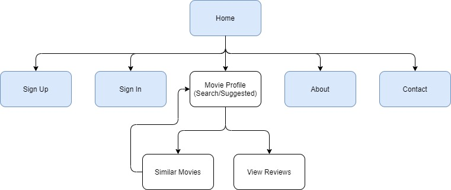
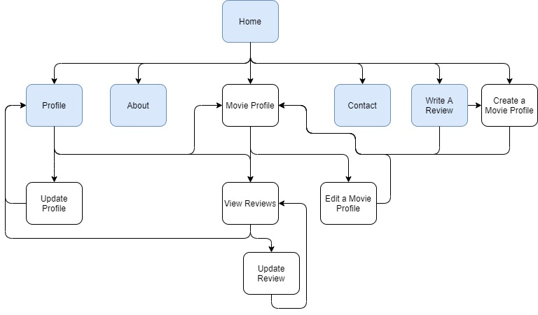
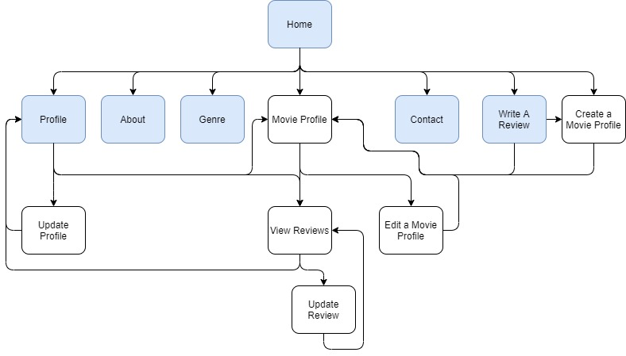

# MovieWiki

[Link to Live Project]()

---
# Introduction

This project is designed to be a space where users can share their honest reviews and opinions on movies.

This is the third of four Milestone Projects that make up the Full Stack Web Development Program at The Code Institute. The main requirements of this project are to *"build a full-stack site that allows your users to manage a common dataset about a particular domain"* using: **HTML**, **CSS**, **Javascript**, **Python+Flask** and **MongoDB**

---

# UI & UX Development Planes

# Strategy

### Project Goals
- Develop a space where users can easily share their opinions on various movies and find other users' reviews,
- Build a responsive app using the Mobile First design principle,
- Present any information in an aesthetically pleasing way,
- Handle any errors in such a way to help the user understand the issue,

### Business Goals
- Provide a service that Users will pay to use,
- Build a platform that can facillitate productive and relevant adverts or sponsored links to secondary sites (eg. Streaming services or Cinemas)

### User Demographic
- All ages and backgrounds
- Has an interest in movies/movies
- More comfortable using mobile devices

### User Stories

1. I just watched a movie and would like to share my opinion of it
2. I am interested in seeing a new movie in the cinema and to help me decide I want to read some reviews and see a rating from my peers
3. I want to find a movie to watch I don't have any ideas
4. I can't remember if I have watched a movie or not but I want to be able to check to save myself time
5. I want to keep track of how many movies I have left to watch in a series before the next film is released

**Casual User** - As a casual user who has not created an account, I want to be able to:
- search and view information about movies (age dependant)
- view movie reviews including ratings (age dependant)
- view details of users
- contact the admin team if I have any problems, see incorrect information or want to report anything
- create an account if I want to do more

**Contributer** - As a contributer who has signed in, I want to be able to:
- do everything a Causal User can
- add, edit or delete my movie reviews
- create movie profiles that don't exist yet
- edit movie profiles that I created
- keep track of what movies I have watched
- delete my User Account

**Admin** - As an administrator, I want to be able to:
- do everything a Contributer can
- delete any Movie Profile
- delete any User Account
- delete any Review
- add, modify or delete any Genre Catagory

### Strategy Table

After an initial planning session I drew up a list of potential features to build into this project. Below is my Importance Viability analysis of these features.

| ID      | Feature | Importance |	Viability |
| ----------- | ----------- | ----------- | ----------- |
| A | View, Create, Edit and Delete Movie Information | 5 | 5 |
| B | View, Create, Edit and Delete Movie Reviews | 5 | 5 |
| C | View, Create, Edit and Delete Movie Genre | 5 | 5 |
| D | Create, Edit and Delete Account and Log In/Out | 5 | 5 |
| E | Moderate Content being submitted by Users | 4 | 2 |
| F | Send Messages to Admin | 5 | 5 |
| G | Recieve notificatons about activity related to the User | 3 | 4 |
| H | Report/Suggest corrections/updates for Movie Profiles | 3 | 3 |
| I | Display Cinema times & location/Link to streaming services on Movie Profile | 3 | 3 |
| J | Search Movie Profiles using Name| 5 | 5 |
| K | Advanced Movie Search using mulitple parameters| 3 | 4 |
| L | View User Profile | 4 | 5 |
| M | Search User Profiles | 2 | 5 |
| N | Display Suggested/Relevant Movies to User | 4 | 5 |
| O | Restrict information about Movies in line with Movie age rating | 4 | 4 |
| P | User Input Validation | 5 | 5 |
| Q | Save Movies onto a personal watched/want to watch list | 4 | 5 |
| R | Links to Socials | 3 | 5 | 

Having performed this analysis, I decided to remove features M, K, G, I, H and E from this production release due to many factors including time limitations

Feature R (Links to socials) has been left in due to its simplicity.

# Scope 

## Functionality Requirements
- Clean and themed presentation of information
 - Easy navigation to the required information
 - Quick loading of the website
 - Quick response times from calls to MongoDB
 - Contact the developer for and feedback or bug reports

## Features

This is a full breakdown of all the features & elements that will be impliments for the first production release of MovieWiki.

### Multi Page Elements

**Notifications** - All notifications will come in the form of "Toasts" displayed on the bottom of the viewing screen.

**Navbar**
- Logo - to establish identity and act as a home button on smaller devices
- Home button - link to homepage
- About button - link to about page/modal containing information and instructions  to inform users on what they can do on the website
- "Write a review" button - link to create_review.html (Only visible when logged in)
- Contact button - link to contact.html which will auto fill user information when logged in
- Sign In/Sign Up buttons - link to sign_in.html/sign_up.html (Only visable when not logged in)
- Profile button - link to view_user.html with hover effect popover that displays username
- Log Out button - runs log_out() function and reloads home page

**Footer**
- Logo - to establish identity and act as a home button
- Copyright information
- Back to top button - for easier navigation of larger pages to links in the navbar
- Links to socials for promotion

### base.html/index.html

- Movie displays - on load will show User appropriate or reccommended movies based on their profile or previous interactions.
- Movie Search Bar - Will search all Movie names and return the results in the space where the Movie Displays were

### sign_up.html

- Form input section - Collects data from user. Favourite Film Genre list generated from Genre collection in the database
- Create Account button - will "POST" the data to the database and return the user to their view_user.html page
- Cancel button - links to homepage

### sign_in.html

- Form input section - Collects data from user
- Login button - compares the submitted data with the stored data to confirm Users identity. If information is correct then User is returned to their view_user.html page

### view_user.html

- User information section - formats and presents information recieved from the database
- Update Profile button - link to sign_up.html in edit mode to edit page content (only avaliable to Admin and the User who created the account)
- Delete Profile button - calls the delete_profile() function and returns user to the homepage with a deletion notification (only avaliable to Admin and the User who created the page)
- Latest Reviews Section - Shows the last 3 reviews this user added. This section includes buttons for every review displayed to View the Movie Profile reviewed, View other Reviews on that particular Movie and, if Admin or the User who created the account, Edit or Delete the review

### genre.html (admin only)

- Add New Genre input and button - Collects admin input and "POST"s it to the database
- Genre Accordion section - An accordion section will be generated for each Genre in the Genre collection with an Update Genre section and Delete Genre button
- Update Genre input and button - Collects admin input and "POST"s it to the database
- Delete - calls the delete_genre() function and returns admin to genre.html

### create_movie_profile.html

- Form input section - Collects data from user. Genre list generated from Genre collection in the database. On focus, a popover will explain what each field requires to validate the input
- "Is this movie part of a seres" switch - This switch toggles the extra input section, in and out of view, which requires additional information about the series that this movie is part of
- Create Movie Profile button - will "POST" the data to the database and return the user to the view_movie.html page they just created
- Cancel button - Cancel button will return User to home page

If user is Admin, there will also be a Delete Profile button. Delete Profile button calls the delete_profile() function and returns user to the homepage with a deletion notification.

If user is editing a Movie profile, then the buttons will be update and cancel but with similar functionality

### view_movie.html

- Movie information section - formats and presents information recieved from the database
- Latest Reviews Section - Shows basic information for the 3 latest reviews for this movie
- "I Have Watched This" Button - Toggles the movie on the Users watch list and adds the glasses icon next to the Movie Title if Movie is on the list
- "View All Reviews" button - links to view_all_movie_reviews.html to allow the user to view all the reviews of that specific Movie
- Accordion Section - Accordion elements containing supporting information, videos and possible API interfaces and monetizable links on future updates
- Edit Profile button - link to create_movie_profile.html in edit mode to edit page content (only avaliable to Admin and the User who created the page)
- Delete Profile button - calls the delete_profile() function and returns user to the homepage with a deletion notification (only avaliable to Admin and the User who created the page)
- Similar Movies Section - Displays movies in the same genre as the current film, not watched by the user and ranked in order of average star ratings

### create_review.html

- Form input section - Collects data from user. Movie title dropdown will be auto filled if coming from a Movie Profile. On focus, a popover will explain what each field requires to validate the input
- Submit Review - will "POST" the data to the database and return the user to the view_movie.html page they just created a review for
- Delete Profile button - calls the delete_profile() function and returns user to the homepage with a deletion notification
- Cancel button - Cancel button will return User to home page 

### view_all_movie_reviews

- Review cards - contain all information in the review
- Update Review button - link to create_review.html in edit mode to edit review content (only avaliable to Admin and the User who created the review)
- Delete Review button - calls the delete_profile() function and returns user to the homepage with a deletion notification (only avaliable to Admin and the User who created the review)

### contact.html

- Form input section - Collects data from user. On focus, a popover will explain what each field requires to validate the input
- Send Message Button - Passes message data onto API to send message. Returns user to contact.html with an empty form and a sent message notification.
- Cancel button - Cancel button will return User to home page 

---
## Features for future releases

- Advanced Movie Search using mulitple parameters
- Search User Profiles
- Recieve notificatons about activity related to - the User
- Display Cinema times & location/Link to streaming services on Movie Profile
- Report/Suggest corrections/updates for Movie Profiles
- Moderate Content being submitted by Users
- Actor/Actresses profiles
- Add computer location to User profile to change movie age restrictions depending on country

## Structure

**Topology Diagrams**

The Blue elements in these diagrams signify pages that are accessable from Navbar at all times.

Buttons not referances will return to the same page, use Ajax so no reload or return the home page.
User Update Profile Page and Update Profile Review only avaliable if User created page or review.

Guest User

Contributer User

Admin User

## Skeleton

To view the wireframes for this project [click here](readme_assets/wireframe_display.md)

### Design

**Colour Scheme**

**Typography**

**Imagery**

# Technologies Used

- [HTML5](https://developer.mozilla.org/en-US/docs/Glossary/HTML5) - Programming Language
- [CSS 3](https://developer.mozilla.org/en-US/docs/Web/CSS) - Programming Language
- [JavaScript](https://developer.mozilla.org/en-US/docs/Web/JavaScript) - Programming Language
- [MongoDB](https://www.mongodb.com/) - Data base storage
- [Flask](https://flask.palletsprojects.com/en/2.0.x/) - Python Web Framework
- [jQuery](https://jquery.com/) - JavaScript Library
- [Bootstrap v4.3.1](https://getbootstrap.com/) - Library Import
- [Google Fonts](https://fonts.google.com/) - Typography Import
- [Git Pod](https://gitpod.io/) - IDE (Integrated Development Environment)
- [Git](https://git-scm.com/) - Version Control Tool
- [Github](https://github.com/) - Cloud based hosting service to manager my Git Repositories
- [Code Institute GitPod Template](https://github.com/Code-Institute-Org/gitpod-full-template) - Provides GitPod extensions to help with code production
- [Google Chrome Development Tools](https://developer.chrome.com/docs/devtools/) - Development Tools
- [Tiny JPG](https://tinyjpg.com/) - JPG and PNG Image Compressor
- [Figma](https://www.figma.com/) - Wireframe designer software
- [HTML Formatter](https://www.freeformatter.com/html-formatter.html#ad-output) - Formatting HTML Code
- [CSS Beautifier](https://www.freeformatter.com/css-beautifier.html) - Beautifying CSS Code
- [JavaScript Validator](https://beautifytools.com/javascript-validator.php) - Validating JS code
- [GIMP](https://www.gimp.org/) - Image editor
- [Coolors](https://coolors.co/) - Colour scheme generator
- [Font Awesome](https://fontawesome.com/) - Icon provider

# Credits

### Code snippets

### Resources

## Content

## Media 

## Acknowledgments

README template used to produce this documentation is from [Code Institute README Template](https://github.com/Code-Institute-Solutions/readme-template)
