# MovieWiki Testing

# Manual Testing

Find all my manual testing criteria, procedure and outcomes in my [Manual Testing Document](ms3-manual-feature-testing.pdf)

--- 

## Features Testing

## User Stories

**Casual/First Time User** 

  
As a Casual/First Time User, I want to be able to:

- Find out more about MovieWiki and how to use it
    - The About page, which is easily accessible from the navbar or sidenav at all times, contains all the information needed.
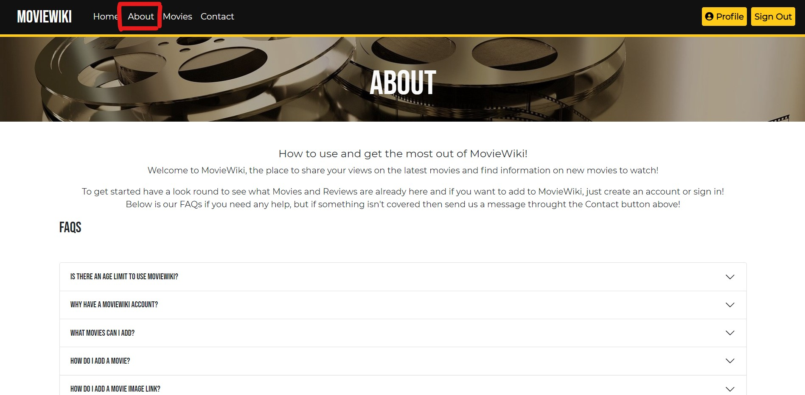

- Search for specific movies or view all movies
    - On the home page the user can search for any movies using the search bar or, they can view all movies via the Movies navbar button or dropdown menu
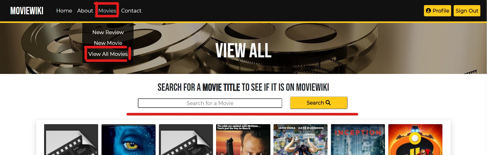

- Find the highest rated movies and the latest releases
    - On the home page, when a user not logged in, the first movie carousel contains the top 15 highest rated movies and the second contains the 15 films with the latest release dates.
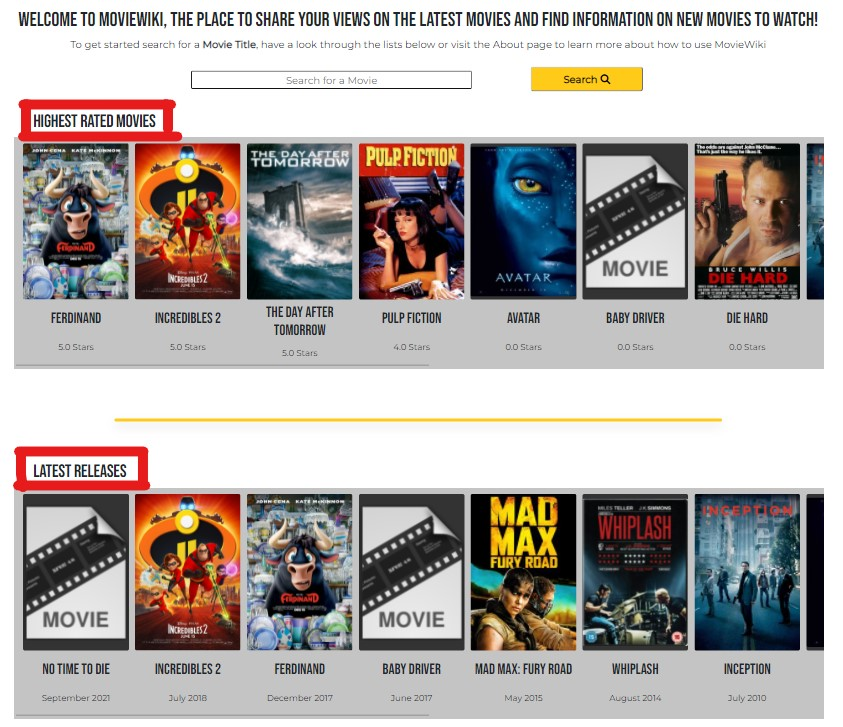

- View information about those movies
    - All information about a movie is accessible by clicking on the movie image on any movie display.
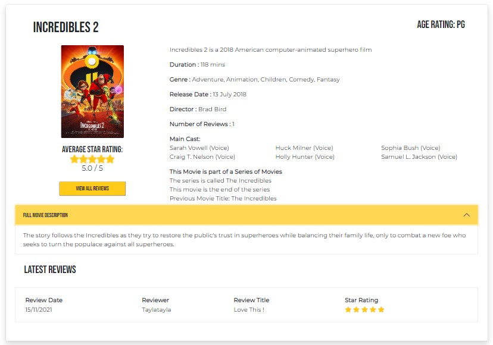

- Quickly establish if I should watch a Movie or not
    - On the movie profile page, the movie synopsis, age rating and average star rating are easy to find and therefore will help the user decide if they want to watch the movie.
    - If the user needs more information, then it is provided further down the page.
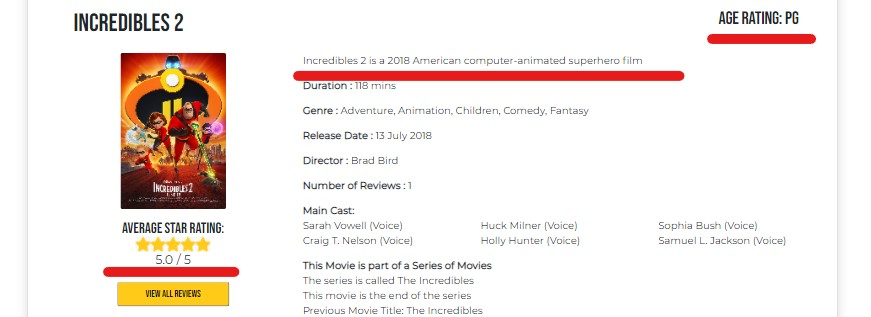

- View movie reviews including ratings
    - There is a View All Reviews button underneath the Average Star Rating on the movie's profile which allows the user to see all the movie's reviews.
    - On the view all review each review is displayed with review text, title, reviewer name, date of review and the star rating displayed using icons to make it more engaging.
    - The user will find the 3 latest reviews for any movie just below the movie description (if provided) on its profile.
    - If there haven't been any reviews for the movies then the latest review section will not display
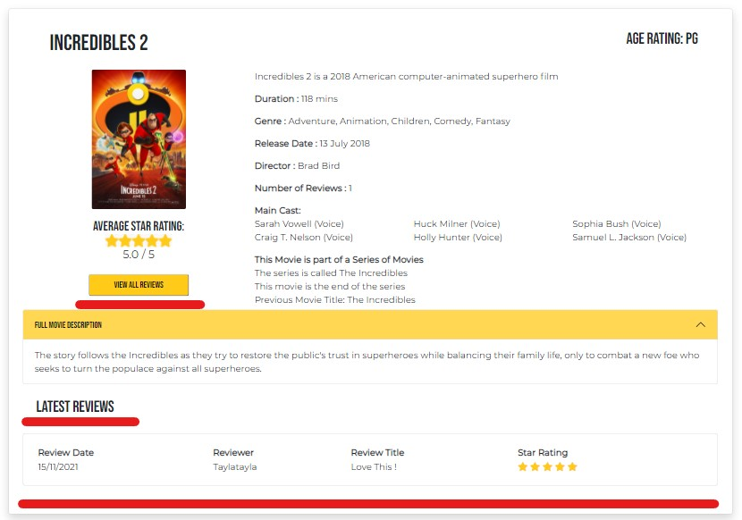
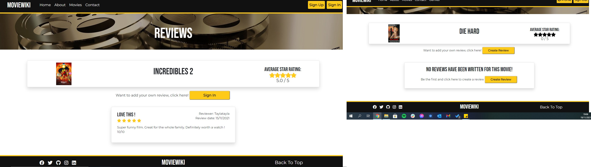

- Contact the admin team if I have any problems, see incorrect information or want to report anything
    - The contact page is always easily accessible from the navbar or sidebar and it is simple to complete and send.
    - When a user is logged in, the name and email fields will autofill for ease of use.
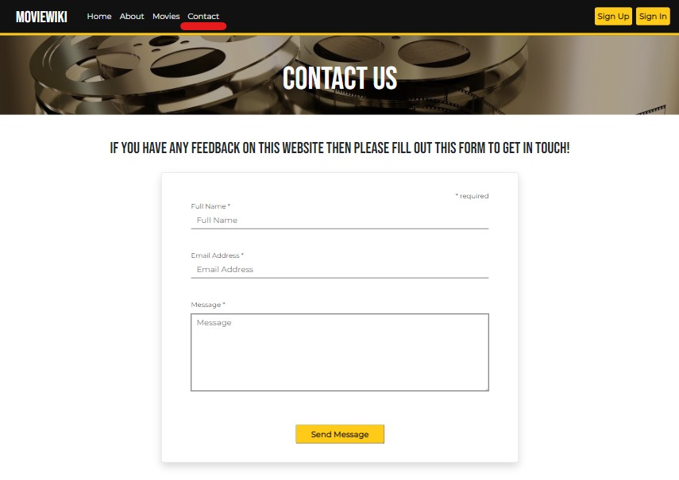
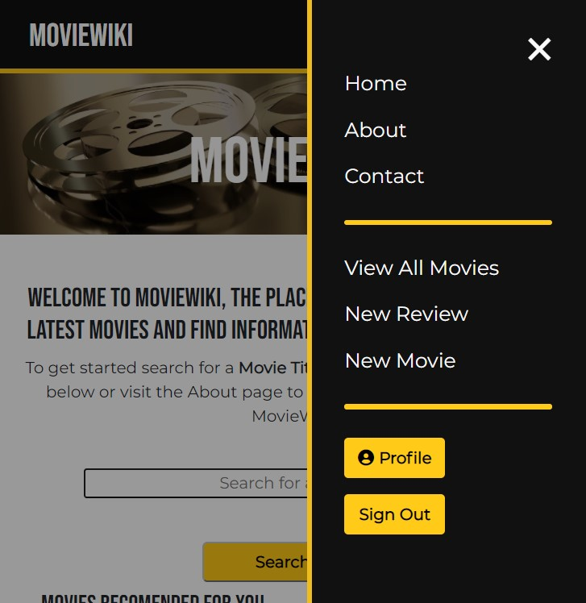

- Create an account if I want to do more
    - The signup page is always easily accessible from the navbar or sidebar through the signup button.

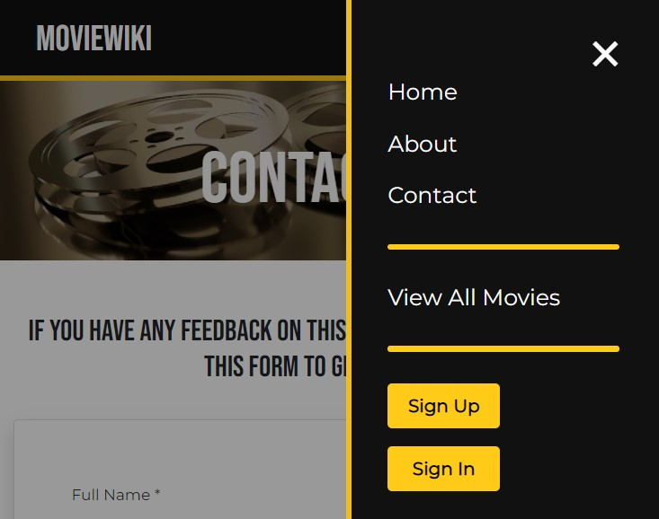

 

**Contributor** 

  
As a Contributor who has signed in, I want to be able to:

- Do everything a Causal User can
    - See above
- Add, edit and delete my own movie reviews
    - Add - The New Review button is in the navbar movies dropdown or the sidenav at all times, when signed in. This take the user to a form to fill out, which has clear required input markers and validation error messages if the input is not what is required.
    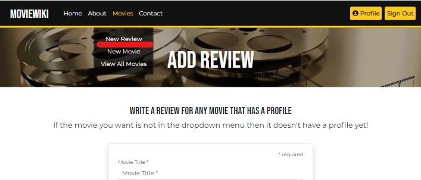
    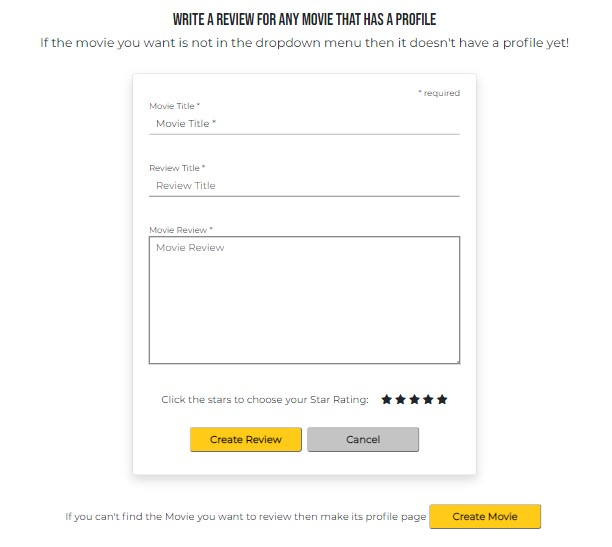
    - Edit - The user can get to the edit movie review page from their profile throught the view all reviews button and then clicking update review on the one they want to edit or via the movie profile, clicking view all reviews and then clicking update review on their review.The update review page is the same as the create movie review page but with the existing values autofilled.
    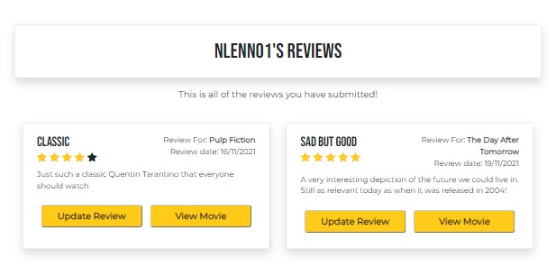
    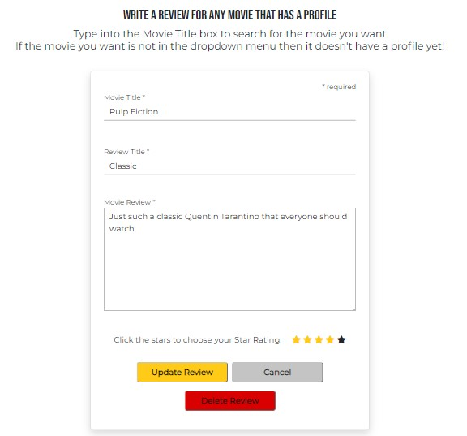
    - The Delete Review button is at the bottom of the update review page and will remove the review from the movie, the user's latest reviews (if applicable) and the users reviewed movies list
- View my latest reviews and all my reviews on the site
    - A user's latest reviews are displayed on their profile page, under the "Your Latest Reviews" heading.
    - To view all a users reviews on MovieWiki, click the View All Review button which is either next to or underneath the "Your Latest Reviews" heading.
    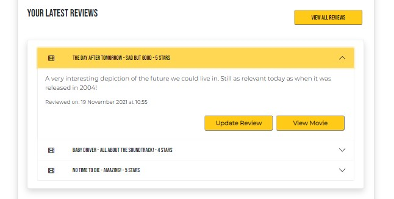
- Create movie profiles that don't exist yet
    - The New Movie button is in the navbar movies dropdown or the sidenav at all times, when signed in. This take the user to a form to fill out, which has clear required input markers and validation error messages if the input is not what is needed.
    
- Edit and delete movie profiles that I created
    - On any Movie Profile the user created, the edit movie profile button is found underneath the movie logo in grey rather than gold to make it stand out from the 3 buttons above it. 
    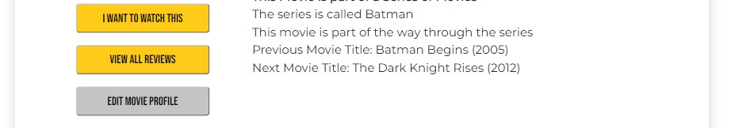
    - When this button is click, the user will be taken to the edit movie profile page, which is the same as the create movie page but with the existing values autofilled.
    - To update the movie all the user has to do is change some values and click update movie
    - The Delete movie button is found at the bottom of the edit movie profile form and will return the user home when the movie is deleted. 
    - Deleting a movie will remove all the reviews for that movie from the movie profile and all users profiles and will also remove the movie name from all users watched, want to watch and reviewed lists.
    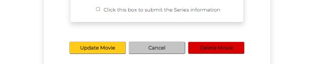
- Keep track of what movies I have watched, reviewed and the ones I want to watch
    - The users movies watched, want to watch and movies reviewed lists are displayed in the users profile in their own accordion sections. All movie names are links to the related movie profile page.
    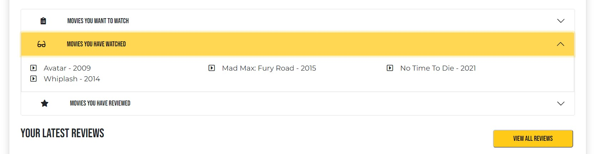
    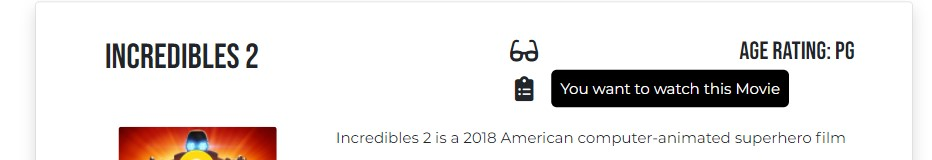
    - To add or remove things from the lists the user just needs to click the buttons below the movie image on the movies profile page. Doing this changes icons for the different lists which have popovers to explain what they mean
    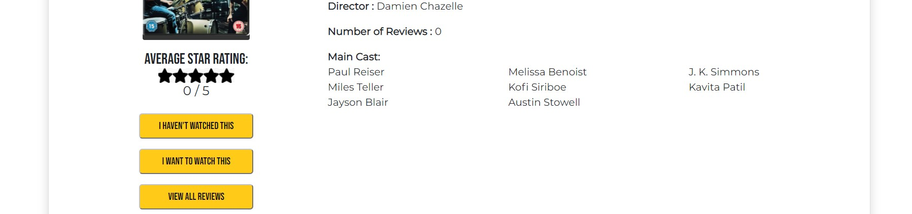
    - On the homepage, the 2nd movie carousel, will contain the users want to watch list movies, as long as the list is not empty. 
    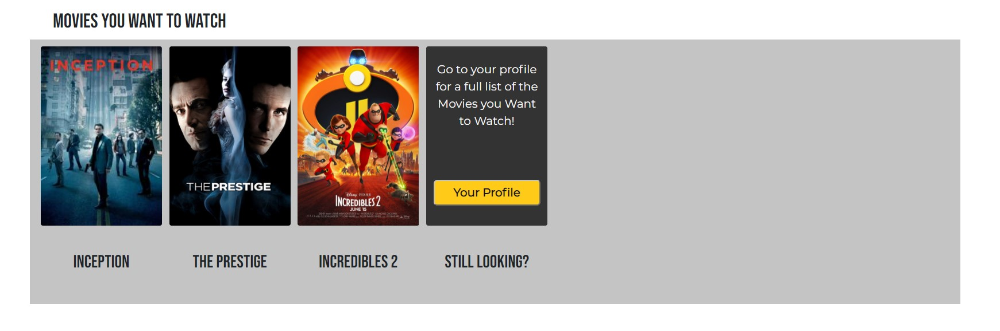
- Have new movies suggested to me based on my movie genre preferences, age, what I have watched and the movie's review scores
    - At the bottom of the users profile page and the first movie carousel on the home page displays "Movies Recommended For You".
    - These movies are the top 15 in the list which is selected based on the users favourite genre list, with any films that have an age rating over the uses age removed and then sorted in by average star rating. Movies that are in the user watched list are also removed from the recommended list.
    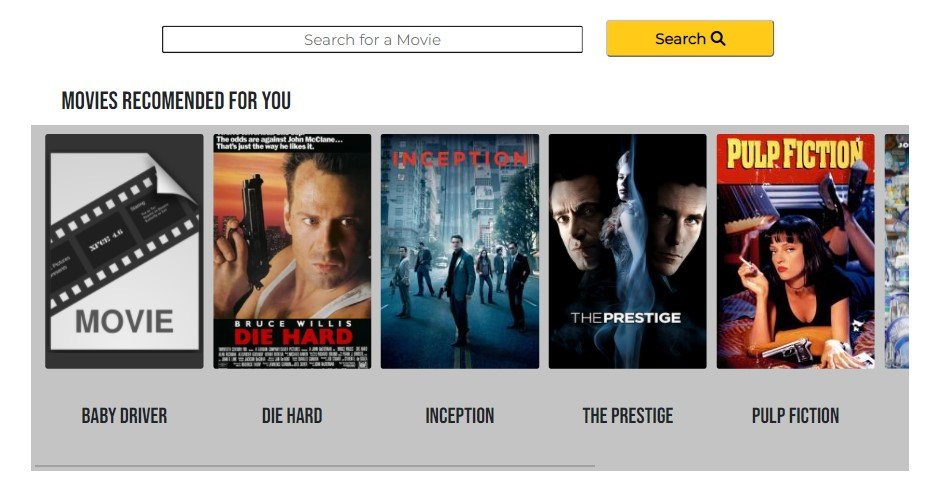
    - When viewing any movie, a movie carousel is displayed at the bottom of the page, which contains movies that share any genres with the current movie, sorted by average rating. The current movie is removed from this list.
    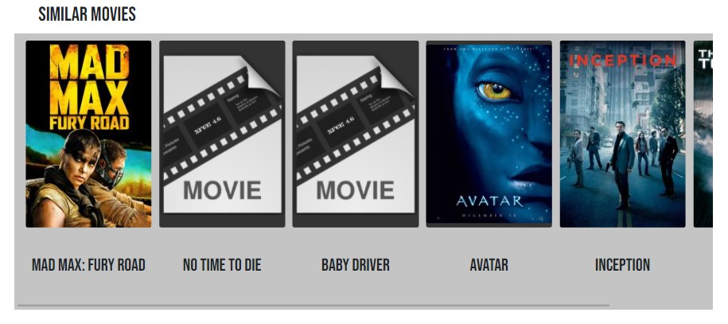
- Edit my account information
    - The update profile button is easily found on the users profile page underneath their username.
    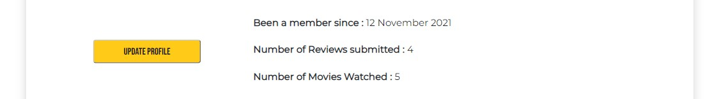
    - This takes the user to the edit user profile form which is autofilled with the existing information to change and submit by clicking the update account button at the bottom of the form
    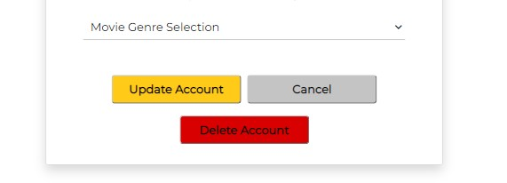
- Delete my account
    - The Delete account button is found at the bottom of the edit user profile page (see above).
    - When clicked the user is shown a confirmation screen which contains details about how their access will be effected if they delete their account.
    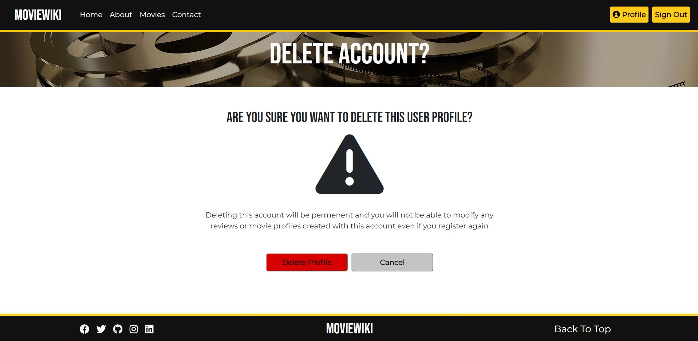

 

**Admin**

  
As an administrator, I want to be able to:

- Have the ability to maintain the website and the content on it
    - A superuser account has the ability to create, edit or delete all movies and delete all reviews on the site
    - Superusers can not edit or delete any User Accounts or edit any user reviews as to prevent user misrepresentation.
    - The ability to delete user accounts has been added to the future feature list.
- Edit and Delete any Movie Profile
    - The Delete & Update Movie buttons are found at the bottom of the Edit Movie Profile page.
    
    - Admin can access the update movie page via the Edit Movie Profile button
    
- Delete any Review
    - Admin can delete any review from the View All Movie Reviews. The button is placed at the bottom of the review card.
    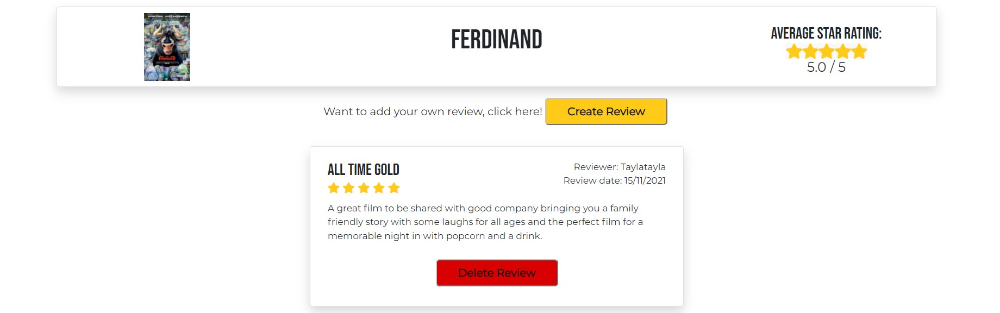
- Add, Modify and Delete any Genre Category
    - The Genre Management page is accessible from the navbar and sidenav at all times, for admin only.
    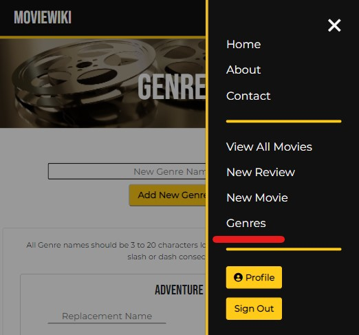
    - All Genre control is accessible from the genre management page through:
        - the new genre bar and add button
        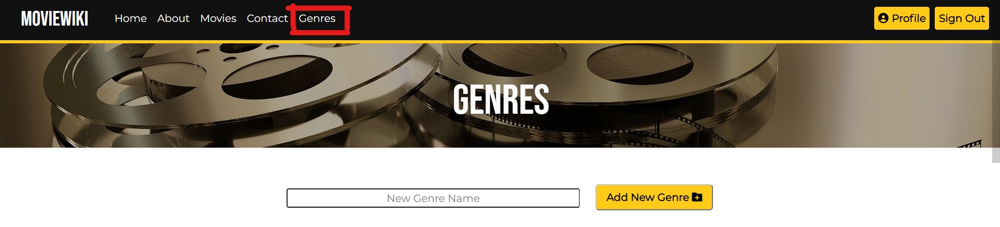
        - the update input field and button
        - the genre delete button 
        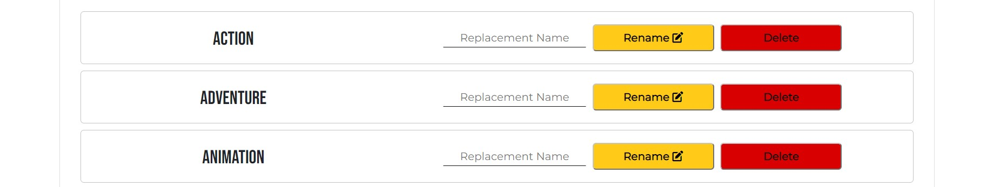

 

## Peer Review 

I requested peer review feedback from my friends, family and the Code Institute slack community. Below you can find any issues or suggestions from my peers and any changes I made in response to the feedback. All other feedback, apart that logged below, was positive.

|Peer |Feedback |Changes Made |
|-----|-----|-----|
|Michael Greenberry (slack)|About page is empty |Added description and FAQ section to About page |
||Date of Birth in Sign Up form doesn't seem necessary|Added filter to user suggested movies to remove any that are age rated over the age of the user |
|Nat Kate (Slack) |Image Link validation/error message incorrect |Check regex patterns. Image Link URL user was inputting was from a webpage and not a hosted image so, I added better instructions to the About page's FAQ section for adding a Movie Image Link
| |Username validation/error message incorrect |Updated regex pattern |
|Hollie Coote |Found spelling errors on a few pages |Ran a spell check on all webpages |
|Tayla Joel | Rather than changing text on Watched and Want to Watch, change button design to be "pushed in" or out |Add feature to future development list |
| | Add a Like/Dislike button to Movie Profile for easier rating |Add feature to future development list |
|Carla Buongiorno (slack)|Genre Dropdown in Sign Up not working |Re-added Bootstrap JS script tag which was removed as I thought it was unused |
|Leo Joseph |Search Function Not Working |User tried searching for words not included in the movie title. I added clearer instructions over all search bars to tell users to search the movie title|

## Responsive Design 

I tested MovieWiki using the [Mobile Compatibility Tester - Google Mobile-Friendly Test](https://search.google.com/test/mobile-friendly) and [Google Chrome Developer Tools](https://developer.chrome.com/docs/devtools/).

Using the Mobile Compatibility Tester, I could only test the pages accessible when the user was not signed in however **all these pages returned good results**.

### Mobile

To test MovieWiki at a Mobile size I used the Iphone 5/SE (320px) for the smaller phones and the Iphone 6/7/8 Plus (414px) for the larger phones. I also tested the Galaxy Fold (280px) as it is the smallest screen width as this is a mobile based app and with the release of folding phone and smartwatches becoming more common, I believe a thin screen is the way more date will be consumed in the future.

I also used my own Samsung Galaxy S10 (360px) for real world testing as it is roughly in the middle of the range of screen sizes I tested on Dev Tools.

### Tablet

To test MovieWiki at a Tablet size I used the Ipad (768px) as it is a very generic size.

I used my Samsung Galaxy Tab 4 (800px) for physical user testing.

### Desktop

I tested the Desktop breakpoint by using my laptop screen (1024px) for real world testing or the 1024px or 1440px breakpoint in Google Chrome Dev Tools. This was because larger screens are becoming more common.

Testing at these screen sizes produced these errors:

|Error |Screen Size (px) |Fix |
|-----|-----|-----|
|User Profile information and Movie information touching the edge of a card |280  |center align the text at smaller widths and add 5px of padding to each side for all elements in .form-card |
|Form and Review Card Elements touching the side of containing card | < 314 |add 5px of padding to each side for all elements in .form-card
|View all reviews button set to the right side of the screen when title above it is centered |576 - 768 | change CSS media query min width on the justify-right attribute of the button to 768px |
|Contact sub-heading text touching edge of container |Any size that the text is pushed onto 2 lines |Move header inside container-md |

After correcting these errors, **MovieWiki has no responsive design errors**.

## Browser Testing

I tested MovieWiki's Browser Compatibility using [Lamdba Test](https://www.lambdatest.com/) for these browsers:
- Chrome (91 on Windows 10)
- Firefox (89 on Windows 10)
- Safari (12 on macOS Mojave)
- Edge (91 on Windows 10)
- Internet Explorer (IE) (11 on Windows 8.1) - FAIL

During initial tests using Lamdba test, the following errors occurred:

|Error Number |Error |Browser |
|-----|-----|-----|
|1 |Navbar buttons out of position |Safari, Edge|
|2 |View Movie Profile all reviews button off center|Safari |
|3 |Date picker on form not working |Safari |

I corrected issue 1 but adding some extra css classes as the error was created by flex display incompatibility.

I have removed Internet Explorer from the table as there were so many compatibility issues including:

- Invalid Message visible at all times
- Select Input Styling wrong
- Sign In not centered
- All Bootstrap elements broken including:
    Accordion broken
    Navbar Dropdown failed
    Checkbox Switches don't work

Upon reflection, I decided that these errors might have been due to the limited versions I could use on Lambda Test with a free account so decided to test manually.

I downloaded Firefox (version 94), Chrome (version 96) and Edge (version 95) onto my Windows 10 machine and called a peer to talk them through testing the page on Safari (version 15.1), so I could manually test all browsers.

**At the time of release, all latest versions of the browsers tested presented no issues**

# Automated Testing

---

## General Testing

I tested the Performance, Accessibility, Best Practices and SEO of MovieWiki using [Lighthouse](https://developers.google.com/web/tools/lighthouse) in Chrome Developer Tools.

I tested the home page initially as it has a large amount of content. As you can see, by the results below, it tested very well on desktop however the performance suffered at mobile.

I decided to test the Movies page, as it contains all the images used on the site currently, to see if the mobile could handle it however the test results were only marginally effected by the extra images.

Finally, I tested the About page on mobile for contract. The results show that while the page on mobile is being effected by having images on it, as you add more images the effect seems to lessen. 

In conclusion, I think that the app performs well at the moment however I can foresee and issue in the future, as the database grown, where the amount of data could need to be limited to improve the app performance.

This could be achieved by setting an image limit size on the URLs uploaded, storing and compressing the images on a server, adding some pagination to the sit as the movie numbers grow or [Lazy Loading](https://web.dev/codelab-use-lazysizes-to-lazyload-images/) and images that are in the carousels but not on screen when loaded at mobile.

Below are the Lighthouse test results:

Test|Desktop |Mobile |
:-----:|:-----:|:------:
Home |  | 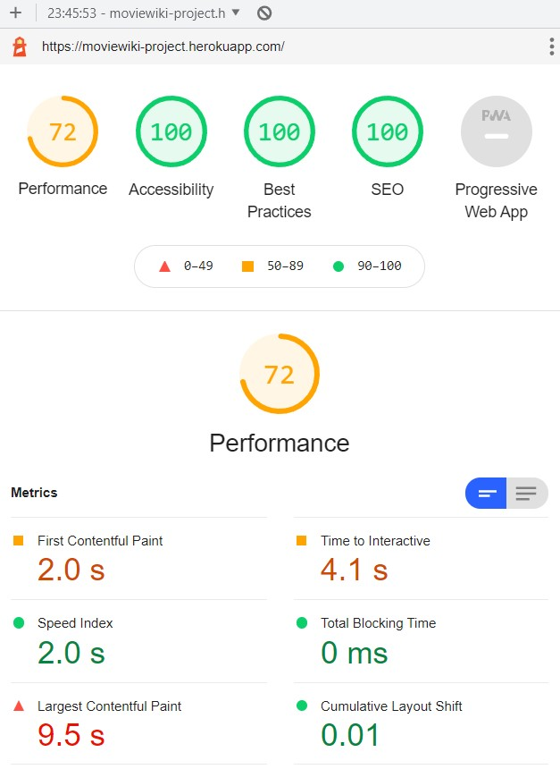 
View All Movies |  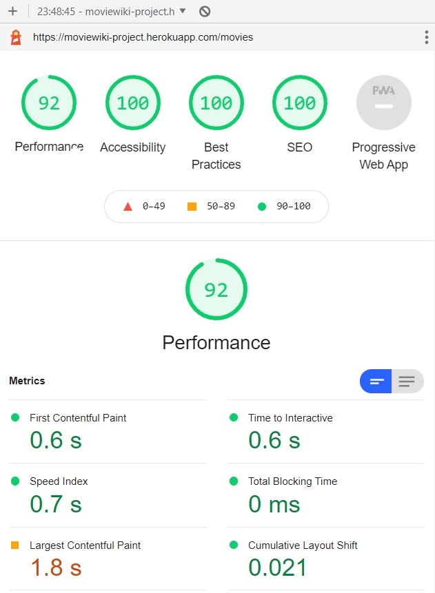| 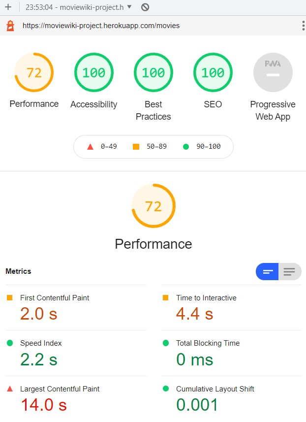 
About |  No Test Taken | 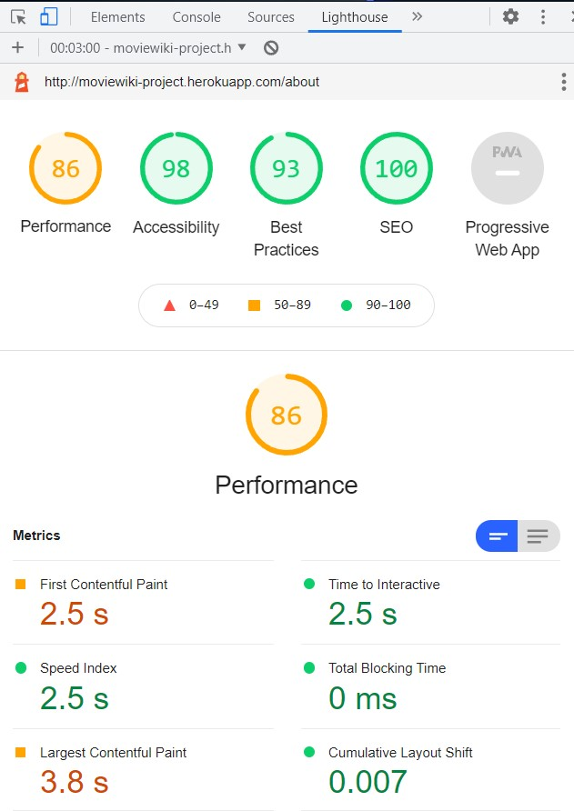 

## Validation

### HTML

To validate the HTML files I used the [W3C Markup Validator](https://validator.w3.org/nu/).
I passed the url into the validator to stop any Jinja Templating Language creating errors.
For the Error page, I opened the page on a web browser, copied the HTML code and directly pasted it into the validator.

  
HTML Validation Errors

Validating the HTML raised several validation errors:
|Error |Solution|
|-----|-----|
|movie image tags with an empty src attribute |add a placeholder of "none" if no movie link when creating/updating a movie document and add a function to check for "none" and replace it with a local image link if found|
|hr elements inside a ul |stop the list and start it again after the hr element in the navbar/sidebar and remove hr from navbar dropdown|
|aria-labelledby attributes of id names that didn't exist |check and update to the correct value (heading -> header)|
|textarea input elements with the pattern attribute |remove pattern attribute from textarea elements and correct error message to just length of input|
|div inside a ul for the dropdown genre lists which were targeted by a JS function |removed the div, added div classes to the ul and changed JS selector values to find ul without div|
|genre select element, for edit movie which is autofilled, which has the required attribute, needs the first option in the list to have a value equal to "" |add a first option with a value of "" and the hidden attribute |
|date input can not have a placeholder attribute |remove the placeholder attribute |
|label's for attribute must point to an Id on the page |update label's for attibute |
|id attribute can not contain whitespaces |use the jinja replace filter to replace whitespaces for dashes|
|duplicated id values for star icons |remove the id sttribute when generating the stars with Jinja|

After correcting these errors, the **HTML passed validation with no issues**. 

Below are the confirmation messages:

  
HTML/Markup Validation

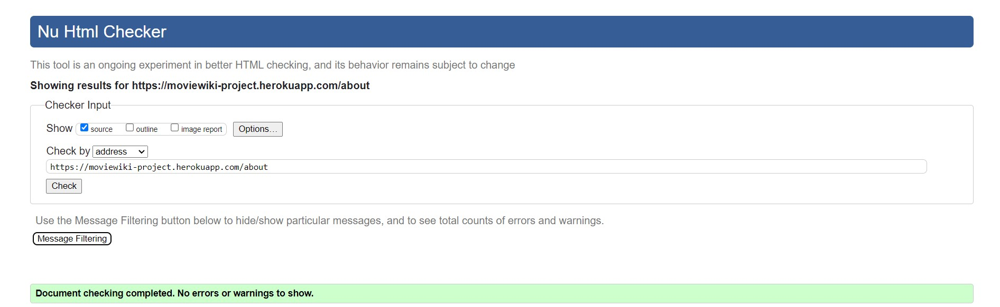
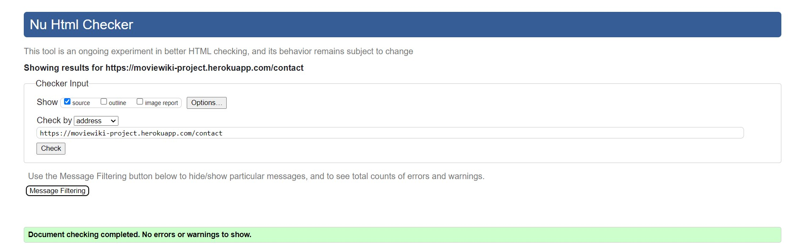
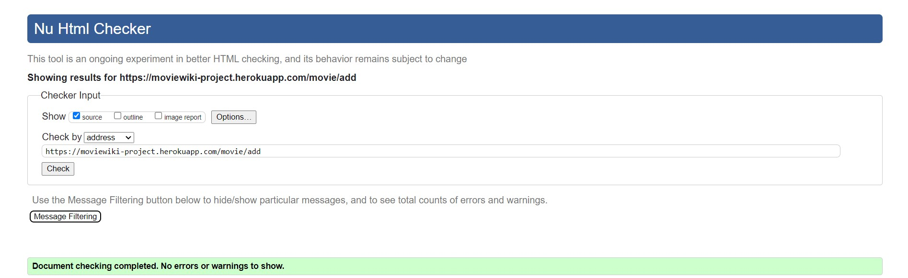
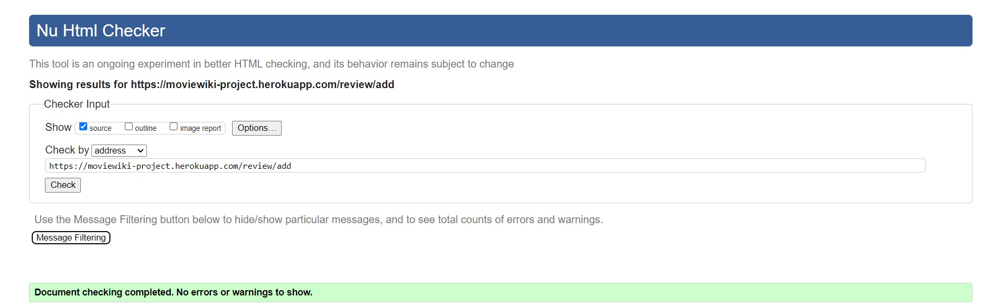
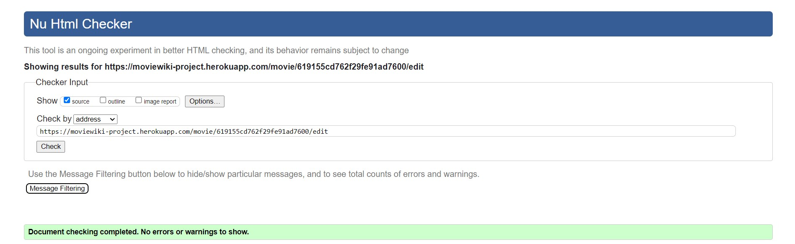
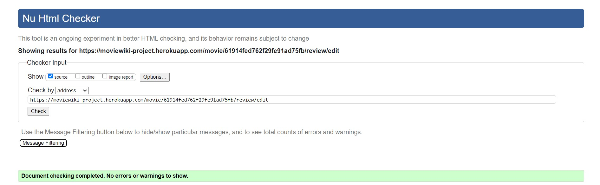
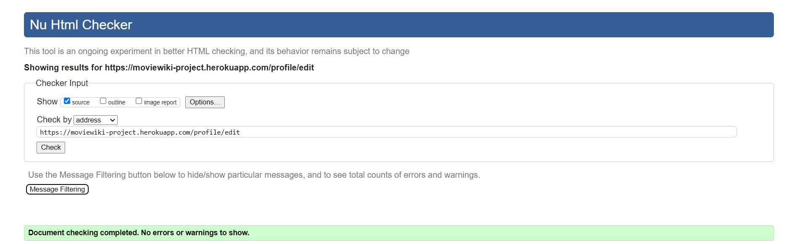

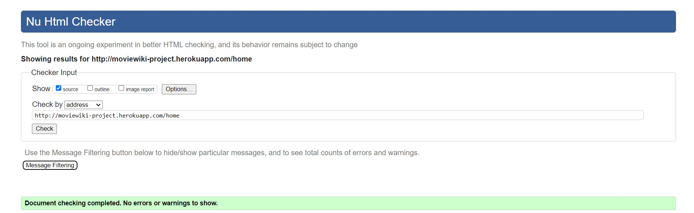
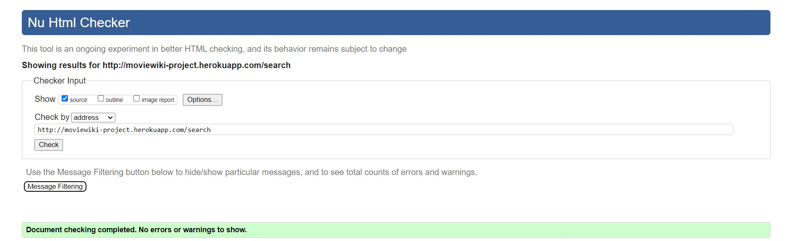
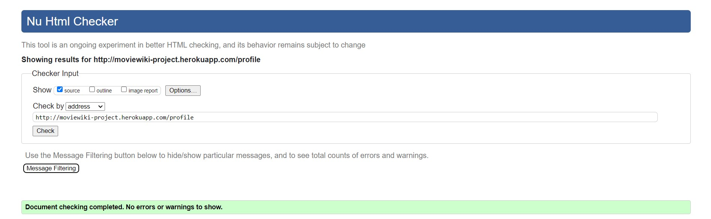

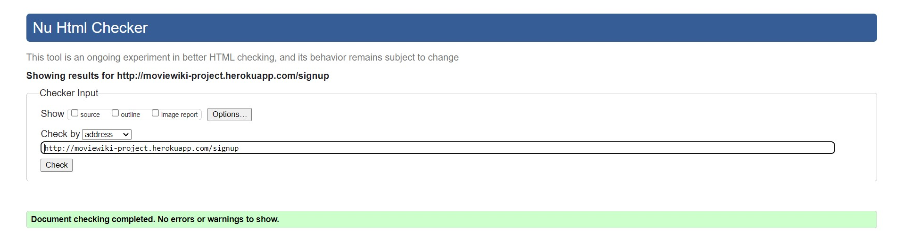
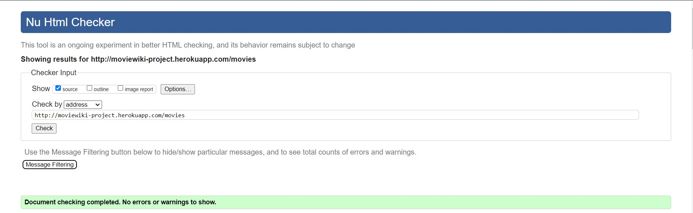
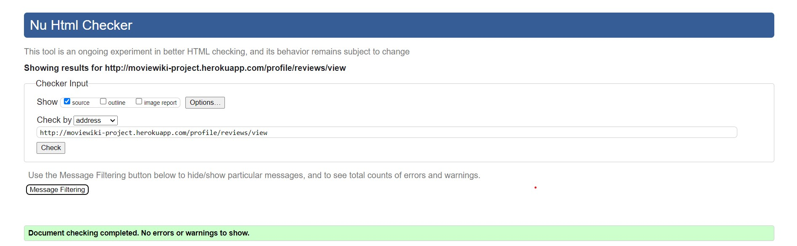
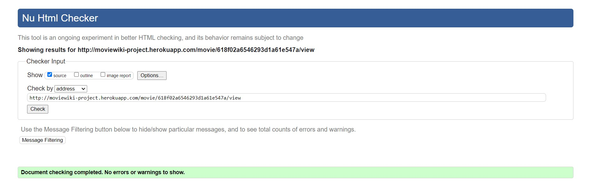
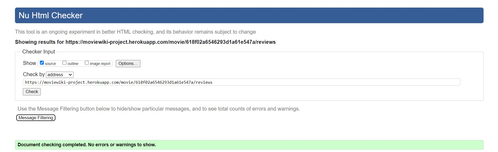
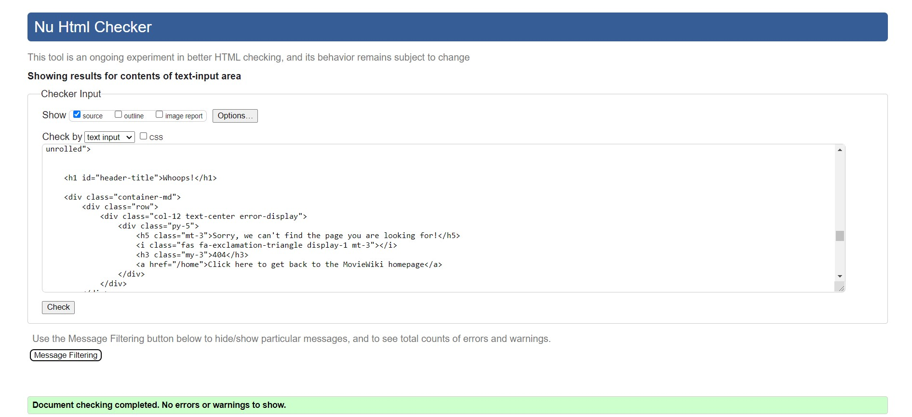

 

### CSS

To validate the CSS file I used the [W3C CSS Validator](https://jigsaw.w3.org/css-validator/).
I tested the style.css by direct input.

When testing the validator found a:
- Parse Error created after using the css selector"["checkboxi]" instead of "[checkbox] i",
- Value Error created by using the font-size attribute rather than the font-weight with the value of 600,

After correcting these issues the **CSS passed validation** with 3 warnings which are about browser compatability which is why they were left.

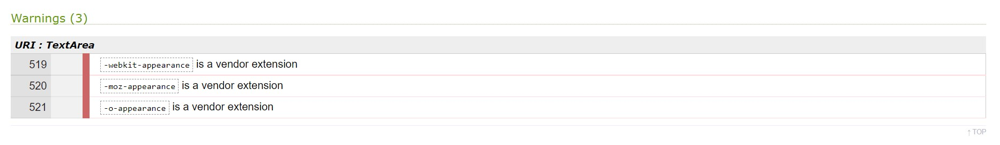
 

### JavaScript

I used the [Beautify Tools JavaScript Validator](https://beautifytools.com/javascript-validator.php) to validate my JavaScript.

During validation, a few errors kept comming up which were:
1. missing semicolon
2. a variable not being defined
3. a function not being defined

I fixed all instances of error 1 and 2 however due to the way I have used the JavaScript functions, either calling them inline from the HTML or from a different JS file using event listeners, the validator can not see where the function is defined or used. 

This means the JavaScript files have the following validation errors because of how the validator works.

  
JavaScript Validation Errors

Base Control

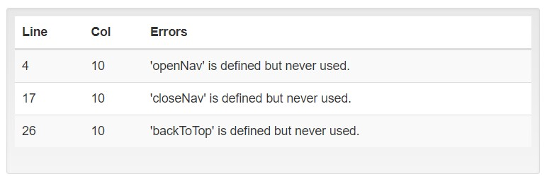

Create Edit Movie Validation

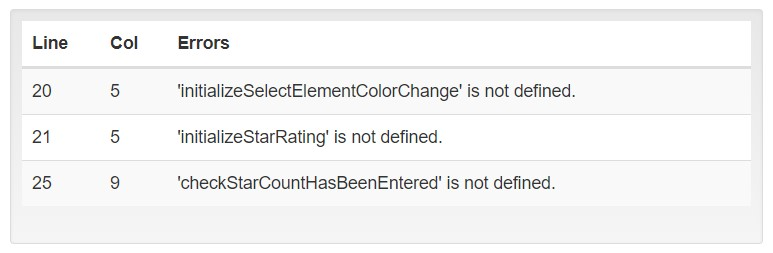

Date Picker

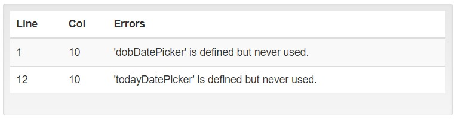

Profile Delete

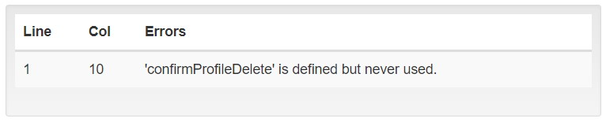

Review Questions

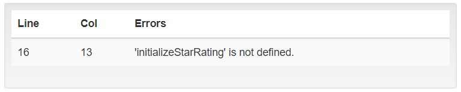

Review Star Function

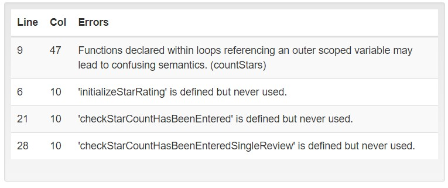

 

### Python

Throughout the building of my projext, I used [flake8](https://pypi.org/project/flake8/) and [pylint](https://www.pylint.org/) installed on my IDE to validate my Python code.

When I had finished building the project, I ran one last test on [PEP8 online](http://pep8online.com/) to confirm my code is PEP8 complient. 

My app.py file **passed all PEP8 compliance validation** with no issues.

  
Python Validation Results

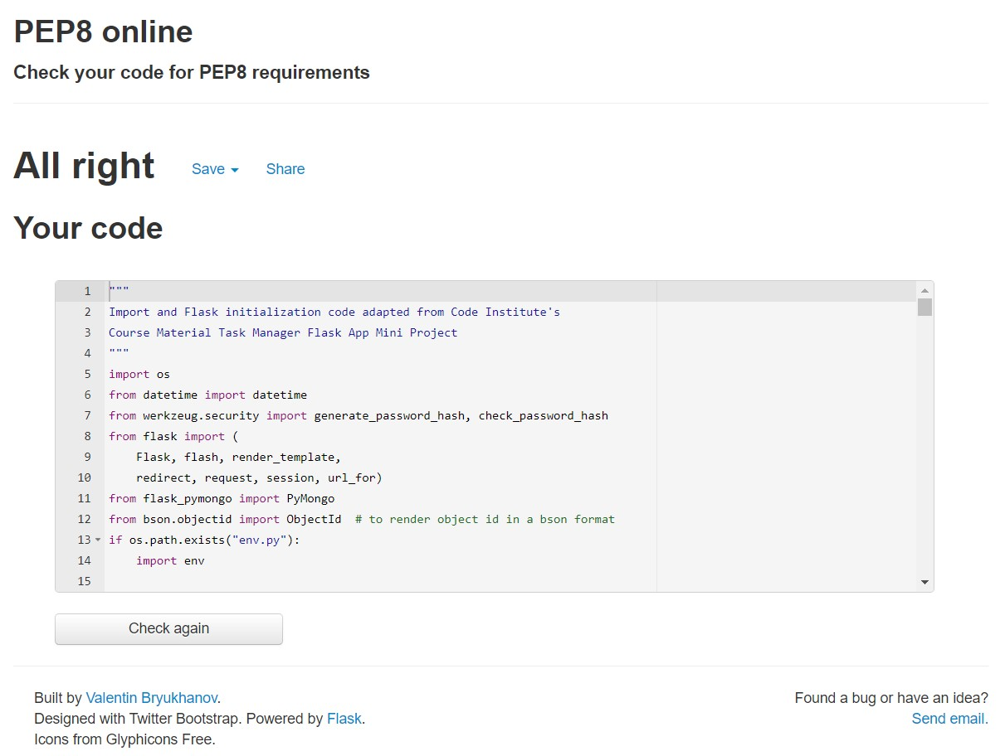

 

### Colour Tester - A11y

I validated my colour scheme contrast on A11y Color Contrast Accessibility Validator to improve accessibility.

I used the Sign Up page as it contains all the colours on the site and is accessabily by a user who is not signed in.

During testing, an issue was raised that the white h1 header text did not contrast enough with the background because the background of the h1 element was set to transparent/white by default. The error occured even though the header is placed on the header image using position relative and absolute. To rectify this issue, I altered the background colour of the h1 element to a translucent black. This darkened the image behind it, emplasizing the header text by increasing the contrast and giving the h1 itself element a darker background for the A11y test.

After this change, the Sign Up page **passed** the colour contrast test with no issues.

  
A11y Results

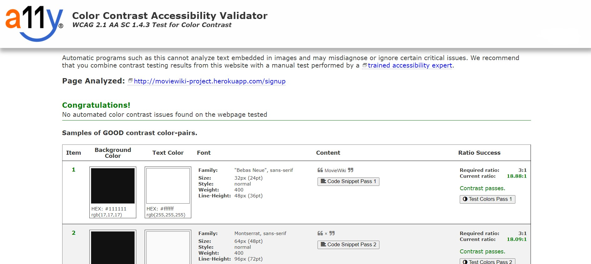

